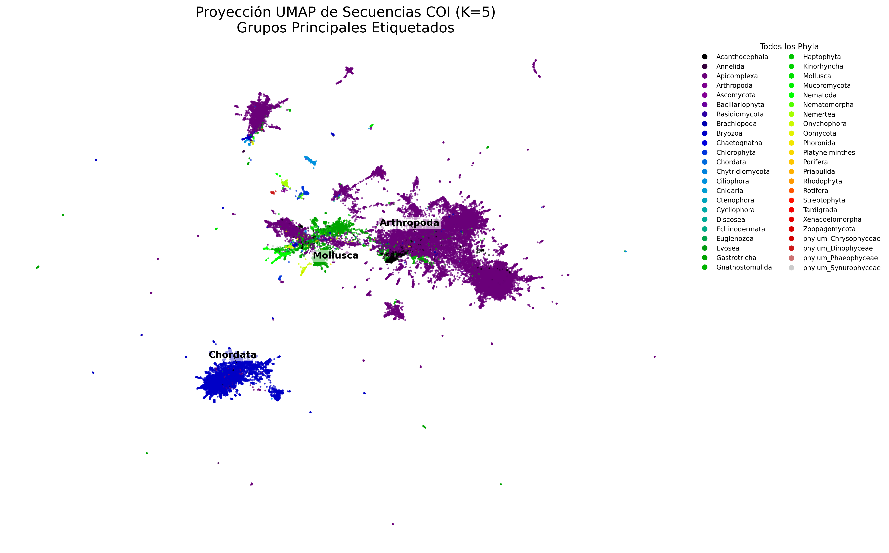
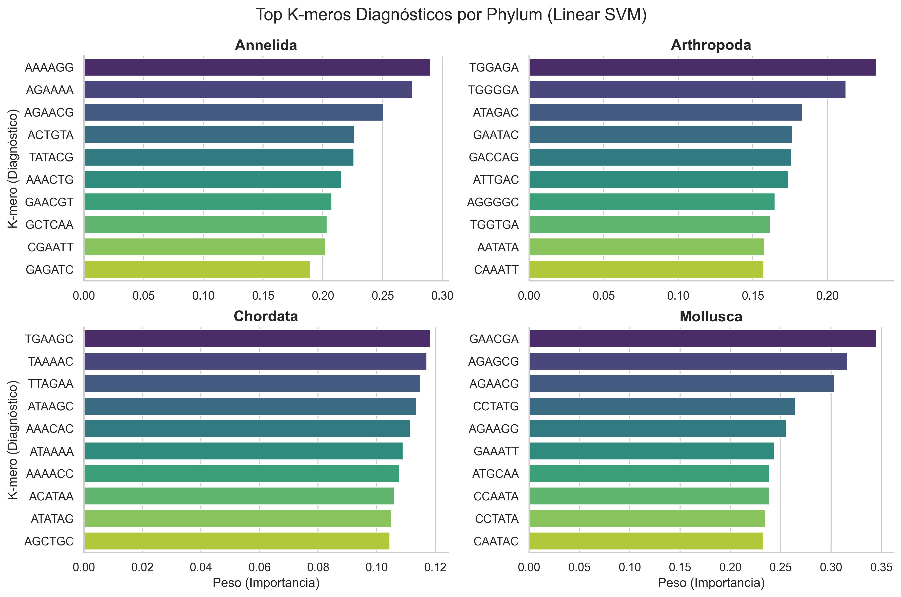
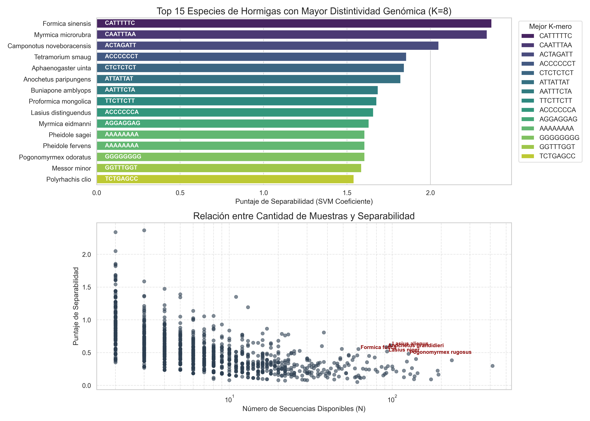

# Identificación de especies a partir de muestras COI - Investigathon

> ****

##  Resumen 
Este proyecto fue realizado para el track de bioinformática del Investigathón 2025 llevado a cabo por Y-hat. Consistió en encontrar maneras eficientes de clasificar especies con un dataset FASTA con casi 2 millones de muestras de COI (Citocromo Oxidasa 1) de taxonomía variada. 

Logramos desarrollar modelos alignement-free con precisión mayor al 99,5% en búsqueda de un equilibro entre exactitud y capacidad de procesamiento.

Nos centramos en la familia Formicidae para profundizar en el análisis y demostramos que una subsecuencia que permitía diferenciar entre especies de hormigas (20k muestras, >90% accuracy) era extrapolable a todo el dataset (1.7M de muestras), alcanzando más del 80% de precisión.
---

## 📊 Gráficos

### La base da datos
Visualización en 2D de 50,000 secuencias representadas vectorialmenente ($K=5$).

## Formas eficientes de separar familias
Identificamos los k-meros que hacen más sencilla la separación entre familias.

## Análisis profundo para hormigas
Alcanzamos insights clave para una de las familias más homógeneas a nivel especie en el dataset.

### Stack Tecnológico
* **Preprocesamiento:** `mmseqs2`, `MAFFT`.
* **Procesamiento:** `Pandas`, `Numpy`, `Biopython` (Manejo de FASTA/FASTQ).
* **Machine Learning:** `Scikit-learn` (SGDClassifier con Hinge Loss, optimizado para High-Dimensional Sparse Data).
* **Visualización:** `Matplotlib`, `Seaborn`, `UMAP-learn`.
